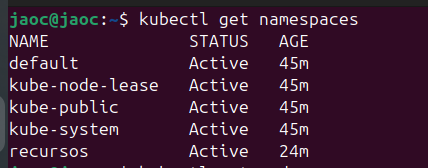

# Actividad - Gestión de Recursos
**Objetivo de la actividad**
- **Configurar recursos en Pods y Deployments:** Aprender a establecer requests y limits de CPU y memoria.
- **Calidad de Servicio (QoS):** Observar cómo cambia la QoS de Pods al variar requests y limits.
- **Prioridad y Preempción:** Comprobar cómo Pods de alta prioridad pueden desalojar Pods de menor prioridad en un clúster saturado.
- **Sobreaprovisamiento (Overcommit):** Experimentar con el sobreaprovisionamiento de CPU.
- **Balancing Pod replicas vs. internal Pod concurrency:** Entender las diferencias entre muchas réplicas pequeñas y pocas réplicas más potentes.

**Prerrequisitos**
- Contar con un clúster Kubernetes (Minikube o Docker Desktop con Kubernetes habilitado).
- Tener kubectl configurado para operar sobre el clúster.
- Permisos para crear y eliminar recursos (Namespaces, Deployments, PriorityClasses).

## Estructura de la actividad

La actividad se desarrollará sobre un namespace dedicado para evitar conflictos con otros recursos. Recomendamos:

```bash
kubectl create namespace recursos
kubectl config set-context --current --namespace=recursos
```
## Paso  1: Especificación de recursos (Requests y Limits)

Código de ejemplo con requests solamente (QoS: Burstable)

#### deploy-requests.yaml
```yaml
apiVersion: apps/v1
kind: Deployment
metadata:
  name: timeserver
spec:
  replicas: 3
  selector:
    matchLabels:
      pod: timeserver-pod
  template:
    metadata:
      labels:
        pod: timeserver-pod
    spec:
      containers:
      - name: timeserver-container
        image: docker.io/wdenniss/timeserver:3
        resources:
          requests:
            cpu: 200m
            memory: 250Mi
```

**Actividad:**
Aplica este Deployment:
```bash
kubectl apply -f deploy-requests.yaml
```



Observa los Pods:
```bash
kubectl get pods -o wide
```


Comprueba la QoS:
```bash
kubectl get pod timeserver-<ID> -o yaml | grep qosClass
```
Deberías ver qosClass: Burstable ya que tiene requests, pero no limits iguales a ellos.


Código con requests y limits (QoS: Burstable o Guaranteed según coincidencia)

```yaml
### deploy_requests_limits.yaml
apiVersion: apps/v1
kind: Deployment
metadata:
  name: timeserver-limits
spec:
  replicas: 3
  selector:
    matchLabels:
      pod: timeserver-pod-limits
  template:
    metadata:
      labels:
        pod: timeserver-pod-limits
    spec:
      containers:
      - name: timeserver-container
        image: docker.io/wdenniss/timeserver:3
        resources:
          requests:
            cpu: 200m
            memory: 250Mi
          limits:
            cpu: 300m
            memory: 400Mi
```
**Actividad:**

Aplica este Deployment
```yamL
kubectl apply -f deploy_requests_limits.yam
```


Comprueba QoS (likely Burstable, pues requests != limits).


## Paso 2: Prioridad y preempción

Crearemos PriorityClasses y Deployments con diferentes prioridades. Primero, la PriorityClass sin preempción:

### priorityclass.yaml

```yaml
apiVersion: scheduling.k8s.io/v1
kind: PriorityClass
metadata:
  name: high-priority
value: 1000000
preemptionPolicy: Never
globalDefault: false
description: "Critical services."
```
**Actividad**

```bash
kubectl apply -f priorityclass.yaml
```


Ahora la PriorityClass con preempción:

```yml
# priorityclass-preemption.yaml
apiVersion: scheduling.k8s.io/v1
kind: PriorityClass
metadata:
  name: high-priority-preemption
value: 1000000
preemptionPolicy: PreemptLowerPriority
globalDefault: false
description: "Critical services."
```
**Actividad**

```bash
kubectl apply -f priorityclass_preemption.yaml
```


### Deployment sin prioridad (muchos Pods)

```yaml
# deploy_no_priority.yaml
apiVersion: apps/v1
kind: Deployment
metadata:
  name: timeserver-np
spec:
  replicas: 15
  selector:
    matchLabels:
      pod: timeserver-pod-np
  template:
    metadata:
      labels:
        pod: timeserver-pod-np
    spec:
      containers:
      - name: timeserver-container
        image: docker.io/wdenniss/timeserver:1
        resources:
          requests:
            cpu: 200m
```
**Actividad**:
- Llena el clúster con Pods sin prioridad:
  ```bash
  kubectl apply -f deploy_no_priority.yaml
  ```
- Verifica Pods pendientes:
  ```bash
  kubectl get pods
  ```


Si tienes pocos nodos, muchos Pods quedarán pendientes o saturarán el nodo.

```yml
apiVersion: apps/v1
kind: Deployment
metadata:
  name: timeserver-hpp
spec:
  replicas: 3
  selector:
    matchLabels:
      pod: timeserver-pod-hpp
  template:
    metadata:
      labels:
        pod: timeserver-pod-hpp
    spec:
      priorityClassName: high-priority-preemption
      containers:
      - name: timeserver-container
        image: docker.io/wdenniss/timeserver:1
        resources:
          requests:
            cpu: 200m
            memory: 250Mi
```

**Actividad:**
- Aplica la implementación de alta    prioridad:
```bash
    kubectl apply -f deploy_high_priority.yaml
```
- Comprueba el estado:
```
kubectl get pods
```
Deberías ver que algunos Pods sin prioridad son desalojados para dar cabida a los de alta prioridad.


## Paso 3: Sobreaprovisionamiento de CPU

Prueba a sobreaprovisionar CPU. Por ejemplo, si tu nodo tiene 2 CPU, intenta correr 20 réplicas con requests de 200m cada una (4 CPUs en total).

Modifica el **deploy_no_priority.yaml** a:

```yml
apiVersion: apps/v1
kind: Deployment
metadata:
  name: overcommit-deploy
spec:
  replicas: 20
  selector:
    matchLabels:
      pod: overcommit-pod
  template:
    metadata:
      labels:
        pod: overcommit-pod
    spec:
      containers:
      - name: timeserver-container
        image: docker.io/wdenniss/timeserver:1
        resources:
          requests:
            cpu: 200m
            memory: 100Mi
```

- Aplica la implementación de alta    prioridad:
```bash
    kubectl apply -f deploy_no_overcommit.yaml
```
- Comprueba el estado:
```
kubectl get pods
```


Muchos estarán corriendo, pero posiblemente estén compitiendo por CPU. Observa con 
```bash
kubectl top pods 
```
(si tienes metrics-server instalado) el uso real y detecta si hay throttling.


## Paso 4: Balanceo entre réplicas de pods y concurrencia interna
Crea 2 deployments para comparar
**Muchas réplicas pequeñas:**
```yml
# deploy_many_small.yaml
apiVersion: apps/v1
kind: Deployment
metadata:
  name: webapp-many
spec:
  replicas: 10
  selector:
    matchLabels:
      app: webapp
  template:
    metadata:
      labels:
        app: webapp
    spec:
      containers:
      - name: web
        image: myorg/webapp:latest
        resources:
          requests:
            cpu: 100m
            memory: 128Mi
          limits:
            cpu: 200m
            memory: 256Mi
```
**Pocas réplicas grandes:**
```yml
# deploy_few_large.yaml
apiVersion: apps/v1
kind: Deployment
metadata:
  name: webapp-few
spec:
  replicas: 3
  selector:
    matchLabels:
      app: webapp2
  template:
    metadata:
      labels:
        app: webapp2
    spec:
      containers:
      - name: web
        image: myorg/webapp:latest
        resources:
          requests:
            cpu: 500m
            memory: 512Mi
          limits:
            cpu: 1
            memory: 1Gi
```

**Aplica ambos:**

```bash
kubectl apply -f deploy_many_small.yaml
kubectl apply -f deploy_few_large.yaml
```
Observa cómo se distribuyen los Pods. ¿Se quedan pendientes algunos por falta de CPU/memoria?
Compara la respuesta de la aplicación si tienes un balanceador enfrente (Service + Ingress) y pruebas de carga. ¿Cuál es más resiliente si falla un Pod? ¿Cuál es más simple de administrar?

## Paso 5: Ajustar Requests y Limits basado en métricas
Opcionalmente, si tienes Prometheus y Grafana, o al menos el metrics-server, recolecta métricas:

- kubectl top pods para ver consumo real.
- Ajusta los requests si ves que el uso medio es muy inferior al request (puedes reducir requests para acomodar más Pods).
- Ajusta los limits si el Pod nunca alcanza el 50% del limit (posiblemente estás siendo muy generoso).


## Paso 6: Limpiar
Una vez concluida la actividad, elimina todos los recursos:
```bash
kubectl delete -f .
kubectl delete namespace recursos
```