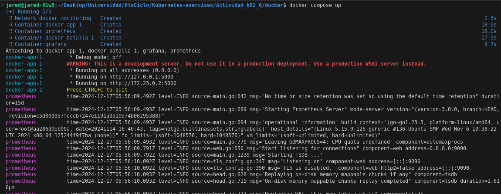
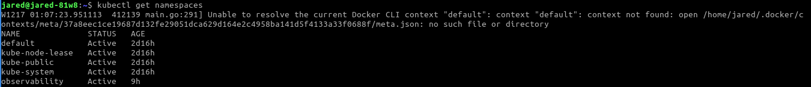
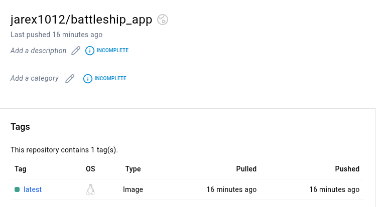
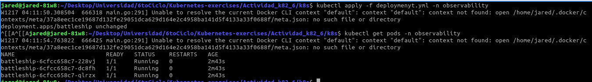
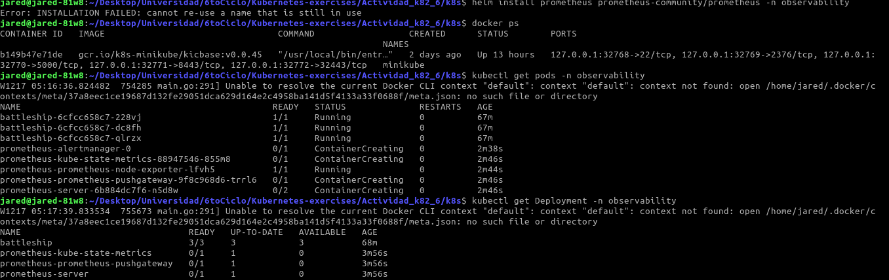
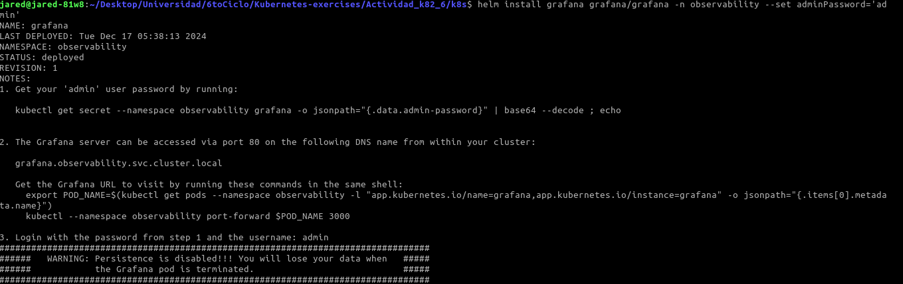
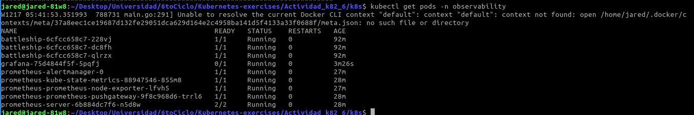
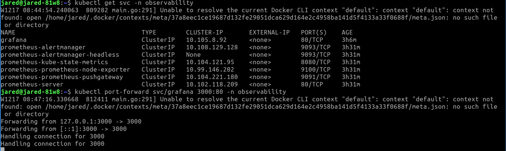
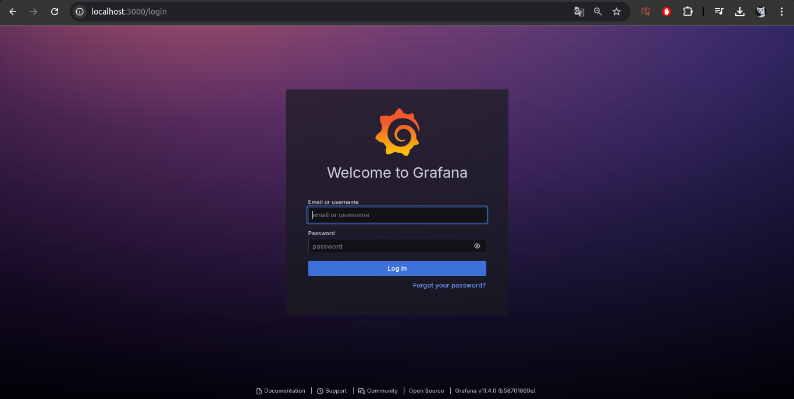
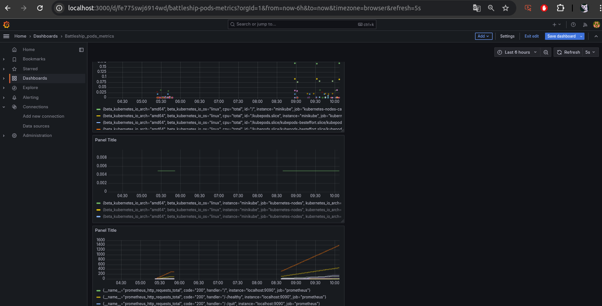

# Kubernetes, monitoreo 

## Uso de docker para pruebas locales



## Despliegue de Kubernetes
1. Crear un namespace donde trabajar


2. Sube la imágen de tu proyecto a Dockerhub.
```bash 
docker tag local-image:tagname new-repo:tagname
docker push new-repo:tagname
```


3. Crea un manifesto para poder crear 3 pods, cada uno con un contenedor de la aplicación.


## Observabilidad completa

Comenzamos con la instalación de Prometheus para la recolección de métricas en nuestro Stack de Observación.

```bash
helm repo add prometheus-community https://prometheus-community.github.io/helm-charts

help repo update

helm install prometheus prometheus-community/prometheus -n observability
```



Instalación de grafana

```bash
helm repo add grafana https://grafana.github.io/helm-charts

help repo update

helm install grafana grafana/grafana -n observability --set adminPassword='admin'
```


**Verificar la instalación**
```bash
kubectl get pods -n observability
```



**Redirigir puertos locales**

Redirecciona los puertos locales, en este caso redirecciona el puerto 3000 del host al puerto 80 de los kubernetes.

```bash
kubectl port-forward svc/grafana 3000:80 -n observability
```


Grafana en el puerto 3000



## Obtener las Golden Signals


